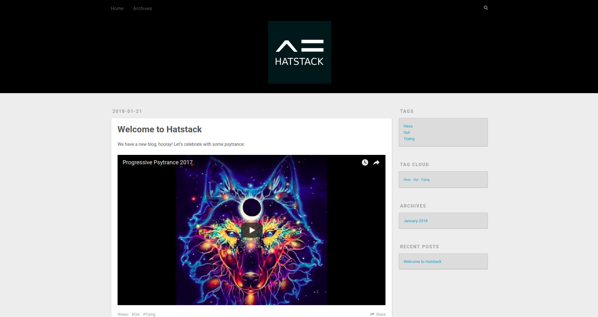

# Hatstack.nl website (in development)




## Prerequisites
To run this project, you will need the following:
- node
- npm
- hexo-cli

# Install
Install dependencies via npm
```
npm install
```

# Usage

Serve the website using hexo:
```
hexo server
```

# More about hexo
See https://github.com/hexojs/awesome-hexo
